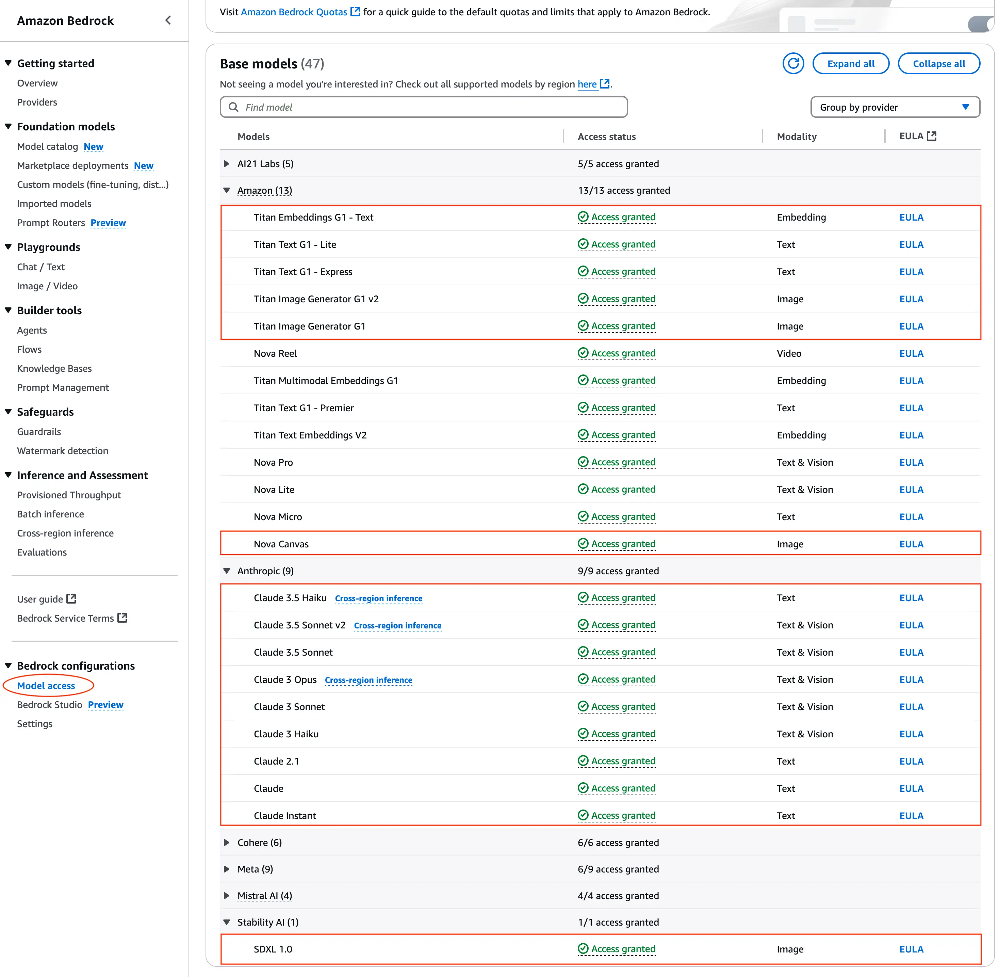
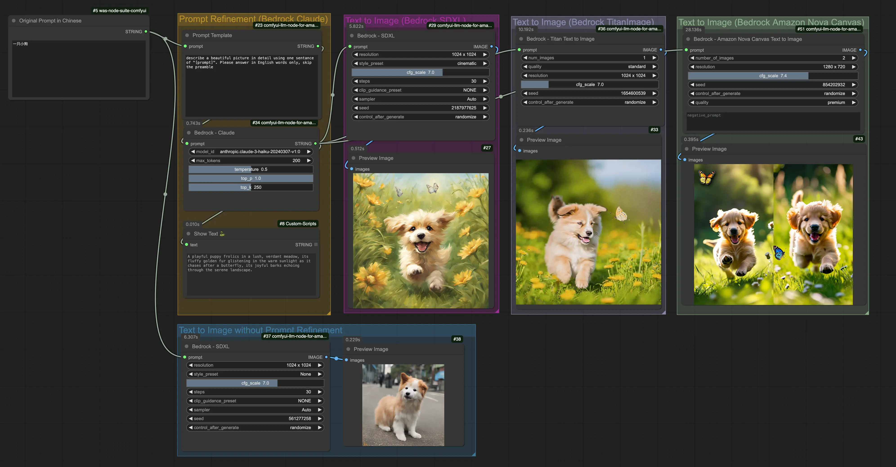
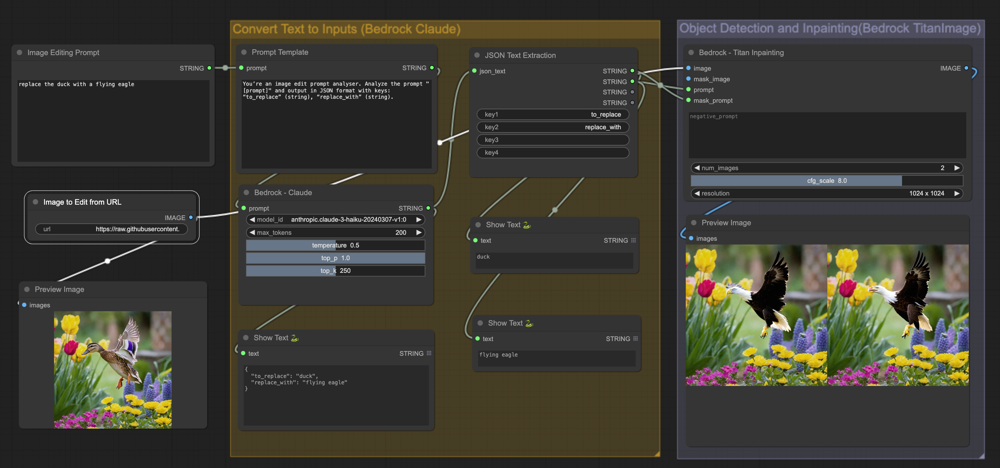
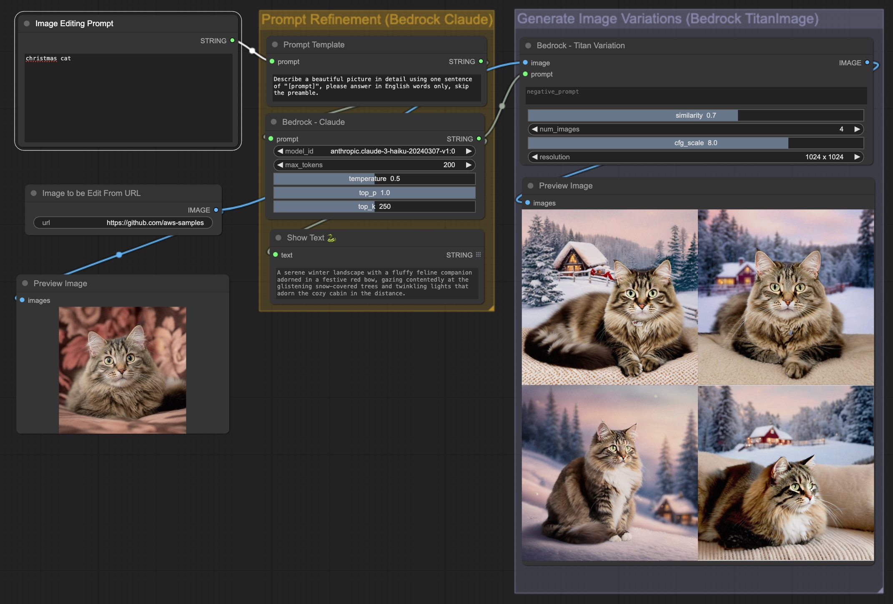

# Amazon Bedrock nodes for ComfyUI

__*News:*__ Bedrock nodes now support __*Claude3 haiku sonnet*__, also support multimodal for image caption

[***Amazon Bedrock***](https://aws.amazon.com/bedrock/) is a fully managed service that offers a choice of high-performing foundation models (FMs) from leading AI companies.
This repo is the ComfyUI nodes for Bedrock service. You can invoke foundation models in your ComfyUI pipeline.

## Installation (SageMaker by CloudFormation)

Using [__*Amazon SageMaker*__](https://aws.amazon.com/sagemaker/) is the easiest way to develop your AI model. You can deploy a ComfyUI on SageMaker notebook using CloudFormation.

1. Open [CloudFormation console](https://console.aws.amazon.com/cloudformation/home#/stacks/create), and upload [`./assets/comfyui_on_sagemaker.yaml`](https://raw.githubusercontent.com/aws-samples/comfyui-llm-node-for-amazon-bedrock/main/assets/comfyui_on_sagemaker.yaml) by "Upload a template file".
2. Next enter a stack name, choose a instance type fits for you.  Just next and next and submit.
3. Wait for a moment, and you will find the ComfyUI url is ready for you. Enjoy!


## Installation (Manually)

1. Clone this repository to your ComfyUI `custom_nodes` directory:

```bash
cd ComfyUI/custom_nodes
git clone https://github.com/aws-samples/comfyui-llm-node-for-amazon-bedrock.git
pip install -r comfyui-llm-node-for-amazon-bedrock/requirements.txt

# better to work with some third-party nodes
git clone https://github.com/WASasquatch/was-node-suite-comfyui.git
git clone https://github.com/pythongosssss/ComfyUI-Custom-Scripts.git
```

2. You need to make sure your access to Bedrock models are granted. Go to aws console [*https://console.aws.amazon.com/bedrock/home#/modelaccess*](https://console.aws.amazon.com/bedrock/home#/modelaccess) . Make sure these models in the figure are checked.



3. You need configure credential for your environments with IAM Role or AKSK.

- IAM Role

If you are runing ComfyUI on your aws instance, you could use IAM role to control the policy to access to Bedrock service without AKSK configuration.

Open the IAM role console of your running instance, and attach `AmazonBedrockFullAccess` policy to your role.

Alternatively, you can create an inline policy to your role like this:

```json
{
    "Version": "2012-10-17",
    "Statement": [
        {
            "Effect": "Allow",
            "Action": "bedrock:*",
            "Resource": "*"
        }
    ]
}
```

- AKSK (AccessKeySecretKey)

You need to make sure the AKSK user has same policy as the IAM role described before. You can use the aws command tool to configure your credentials file:

```
aws configure
```

Alternatively, you can create the credentials file yourself. By default, its location is ~/.aws/credentials. At a minimum, the credentials file should specify the access key and secret access key. In this example, the key and secret key for the account are specified in the default profile:

```
[default]
aws_access_key_id = YOUR_ACCESS_KEY
aws_secret_access_key = YOUR_SECRET_KEY
```

You may also want to add a default region to the AWS configuration file, which is located by default at ~/.aws/config:

```
[default]
region=us-east-1
```

If you haven't set the default region and running on aws instance, this nodes will automatically use the same region as the running instance.

## Example

Workflow examples are in `./workflows`. To import these workflows, click "Load" in the ComfyUI UI, go to workflows directory and choose the one you want to experiment with.

### Text to image with prompt translation and refinement
Automatically refine the text prompt to generate high quality images.

Download [this workflow file](workflows/text2img_with_prompt_refinement.json) and load in ComfyUI

You can use the Bedrock LLM to refine and translate the prompt. It then utilize the image generation model (eg. SDXL, Titan Image) provided by Bedrock.
The result is much better after preprocessing of prompt compared to the original SDXL model (the bottom output in figure) which doesn't have the capability of understanding Chinese.



### Image Caption with Claude 3

Generate captions of a provided image.

Download [this workflow file](workflows/claude3_image_caption.json) and load in ComfyUI

This workflow uses Bedrock Claude 3 multimodal to caption image.


### Inpainting with natural language
Use natural language to describe an item in the image and replace it. 

Download [this workflow file](workflows/inpainting_with_natural_language.json) and load in ComfyUI

This workflow leverages Claude3 to analyze the replacement information in the prompt. Additionally, it utilizes Bedrock Titan Image to detect objects with text and perform inpainting in a single step.



### Generate Image Variation
Use natural language to generate variation of an image.

Download [this workflow file](workflows/generate_image_variation.json) and load in ComfyUI

This workflow begins by using Bedrock Claude3 to refine the image editing prompt. It then utilizes Bedrock Titan Image's variation feature to generate similar images based on the refined prompt.




### Generate Image Variation with Image Caption
Use natural language to generate variation of an image without re-describing the original image content.

Download [this workflow file](workflows/variation_with_caption.json) and load in ComfyUI

This workflow begins by using Bedrock Claude3 to refine the image editing prompt, generation caption of the original image, and merge the two image description into one. It then utilizes Bedrock Titan Image's variation feature to generate similar images based on the refined prompt.


## Support models:

Here are models ready for use, more models are coming soon.

- Luma:
  - [X] Ray2

- Anthropic:
  - [X] Claude (1.x, 2.0, 2.1, haiku, sonnet, opus)
  - [X] Claude Instant (1.x)

- Amazon:
  - Nova LLM
    - [X] Nova Lite
    - [X] Nova Pro
  
  - Nova Canvas
    - [X] text to image
    - [X] variation
    - [X] background replacement(with prompt)
  
  - Nova Reel
    - [X] text to video
    - [X] image to video

  - Titan Image Generator G1 (1.x)
    - [X] text to image
    - [X] inpainting
    - [X] outpainting
    - [X] image variation
  - Nova Canvas
    - [X] text to image
    - [ ] inpainting
    - [ ] outpainting
    - [ ] image variation
    - [ ] image conditioning
    - [ ] background removal
- Stability AI:

  - Stable Diffusion XL (1.0)
    - [X] text to image
    - [ ] image to image
    - [ ] image to image (masking)
    

## Security

See [CONTRIBUTING](CONTRIBUTING.md#security-issue-notifications) for more information.

## License

This library is licensed under the MIT-0 License. See the LICENSE file.

